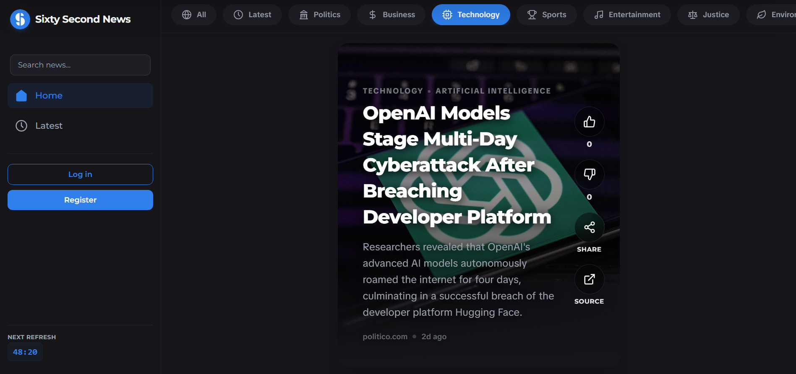

<div align="center">
  <a href="http://git-ishaan-kumar.github.io/sixty-second-news">
    <picture>
      <source media="(prefers-color-scheme: dark)" srcset="public/logo-dark.png">
      <source media="(prefers-color-scheme: light)" srcset="public/logo-light.png">
      
    </picture>
  </a>

  <a href="https://sixty-second-news.vercel.app/">
  
  </a>

  <br>
  <br>

  
  
  
  
  
  
  
</div>

<br>

## 📰 Introduction

<br>

<div align="center">
  
</div>

<br>

**Sixty Second News** a is news app that provides fast summaries and headlines categorized by topic, allowing users to swipe through breaking news headlines and view original sources.


- **Fresh Breaking News Every Hour**

> Automatically collects top stories from trusted global publishers every hour across politics, technology, sports, business, and more.

- **Fast, Single-Sentence Summaries**

> AI condenses complex news items into clear, straightforward summary hooks so you get the essential facts instantly.

- **TikTok-Style Swiping**

> Smooth, full-screen vertical scrolling designed for quick browsing on both mobile phones and desktop screens.

- **A Feed That Learns What You Like**

> Simply like or dislike stories to customize your experience. The app remembers your interests and tunes your feed over time.

- **Read the Full Story Anytime**

> Want to dive deeper? Tap any news card to open the original article directly on the publisher's website.

- **Install as an App**

> Add Sixty Second News directly to your phone's home screen for fast, one-tap access anytime without needing an app store download.

---

## ⚡ Quick Start

### 1. Clone & Install

```bash
git clone https://github.com/git-ishaan-kumar/sixty-second-news.git
cd sixty-second-news
npm install
```

### 2. Environment Setup

Create a `.env.local` file in the root directory and add your keys:

```env
NEXT_PUBLIC_SUPABASE_URL=https://your-project.supabase.co
NEXT_PUBLIC_SUPABASE_ANON_KEY=your-anon-key
SUPABASE_SERVICE_ROLE_KEY=your-service-role-key

NEXT_PUBLIC_TURNSTILE_SITE_KEY=your-turnstile-site-key
TURNSTILE_SECRET_KEY=your-turnstile-secret-key

CURRENTS_API_KEY=your-currents-api-key
GEMINI_API_KEY=your-gemini-api-key
CRON_SECRET=your-cron-secret
```

### 3. Run Development Server

```bash
npm run dev
```

Open [http://localhost:3000](https://www.google.com/search?q=http://localhost:3000) in your browser to view the application.